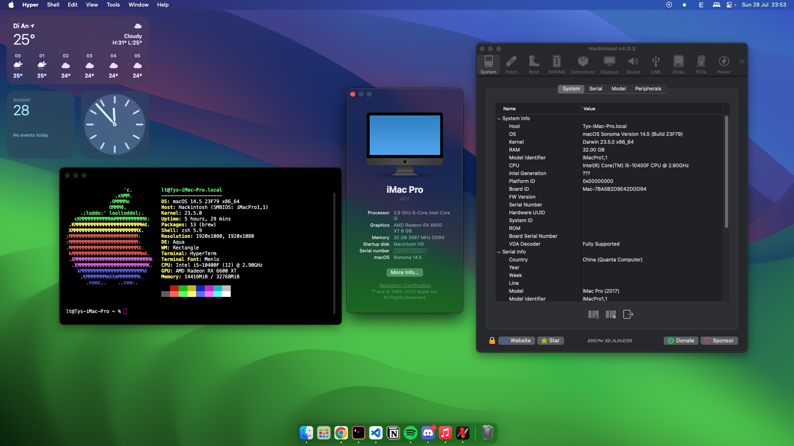

# MSI MAG B460M MORTAR Motherboard Hackintosh EFI - macOS 11+

OpenCore bootloader for MSI MAG B460M MORTAR Motherboard. Running up to macOS Sequoia 15.0.

### Build specifications
* **CPU**: [Intel® Core™ i5-10400F @ 2.90GHz](https://www.intel.com/content/www/us/en/products/sku/199278/intel-core-i510400f-processor-12m-cache-up-to-4-30-ghz/specifications.html)
* **RAM**: To be updated
* **GPU**: [PowerColor Fighter Radeon RX 6600 XT 8GB](https://www.powercolor.com/product?id=1623918140)
* **Storage**:
    * **NVMe**: Western Digital PC SN530 256GB
    * **SSD**: Gigabyte SSD SATA III 240GB
    * **HDD**: WD Blue 1TB WD10EZEX
* **Motherboard**: [MSI MAG B460M MORTAR](https://www.msi.com/Motherboard/MAG-B460M-MORTAR)
* **PSU**: Cooler Master ELITE V4 600W
* **Wireless Card**: Broadcom BCM94360CS

### Warning
This EFI configuration is only for reference. My config might not be compatible to yours. Please visit [OpenCore Install Guide](https://dortania.github.io/OpenCore-Install-Guide/) to build yourself one.

### Features
- Full graphics acceleration with supported GPUs
- Full proper acceleration with SideCar and Mirroring
- DRM with AMD dGPU configuration.
- USB 2.0, 3.0 and Type-C
- Ethernet
- Audio
- Sleep & Wake
- CPU Power Management
- iServices
- SMBUS
- Continuity features (BCM94360CS)

### Credits
- [Apple](https://apple.com) for [**macOS**](https://apple.com/macos)
- [acidanthera](https://github.com/acidanthera) for [**OpenCore**](https://github.com/acidanthera/OpenCorePkg), [**Lilu**](https://github.com/acidanthera/Lilu), [**WhateverGreen**](https://github.com/acidanthera/WhateverGreen) and [**AppleALC**](https://github.com/acidanthera/AppleALC)
- [Dortania](https://dortania.github.io) for [**OpenCore Install Guide**](https://dortania.github.io/OpenCore-Install-Guide)
- [QuanTrieuPCYT](https://github.com/QuanTrieuPCYT) for literally everything. I'd marry him if I were something else.